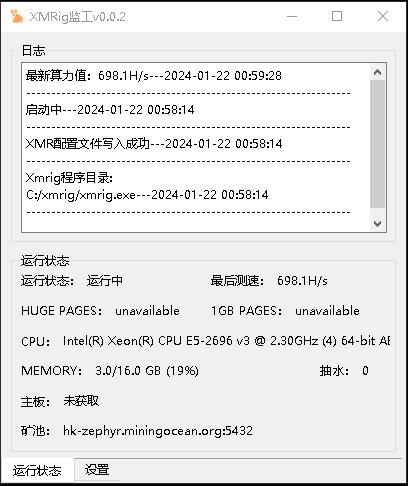
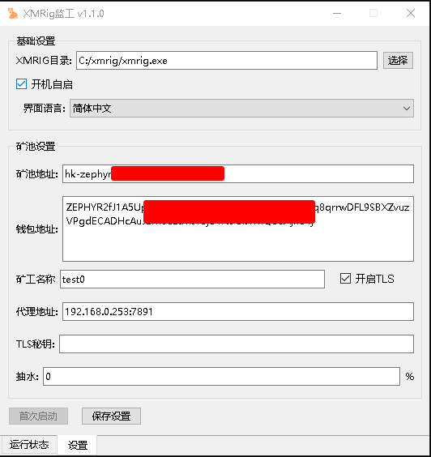

# XMRig Watchdog
---
### [中文](/README.md) | [English](docs/README-EN.md)

### 说明
一个使用python + pyqt5开发的xmrig可视化监工程序,配置简单 自动启动并检测xmrig运行情况

### 界面展示



### 更新日志
##### 2024/1/21
- 添加更新检测
##### 2024/1/25
- 添加更新程序
##### 2024/1/26
- 修正xmrig的配置文件错误
##### 2024/1/27
- 修正n/a导致的无法重启xmrig
- 优化watchdog重启xmrig代码
##### 2024/1/31
- 添加语言选择
- 优化矿机信息获取方式 使用re代替split

### 下载发行版
- github点击Releases并下载最新版本
- gitee点击 发行版 并下载最新版本


```bash
#右键点击下载好的.zip文件 再点击
解压到 "XMRigWatchdog\"(E)
```

### 自行构建
clone本项目到本机
下载python-3.12.0-embed-amd64.zip并解压 修改目录名为libs 拷贝至程序目录

修改libs目录中的python312._pth文件 去掉 import site 前面的 #
```python
python312.zip
.

# Uncomment to run site.main() automatically
import site
```

下载get-pip.py到libs目录中

打开cmd窗口并cd到libs目录下 运行
```bash
python get-pip.py
# 等待pip安装完成 速度可能很慢 需要魔法
# 设置国内源
python -m pip config set global.index-url https://pypi.tuna.tsinghua.edu.cn/simple

#安装virtualenv
python -m pip install virtualenv
```

双击install.bat

##### 测试
打开cmd窗口并cd到程序目录 运行
```bash
# 先运行虚拟环境
.libs\scripts\activate
# 安装依赖
pip install -r requirements.txt
# 运行并测试
python main.py
```
##### 打包
```bash
pyinstaller --noconfirm --windowed --icon "icon/icon.ico" --name "XMRigWatchdog" --upx-dir "你的upx路径"  "main.py"
```
如果不使用upx就把 --upx-dir "你的upx路径" 从命令中去掉

打包好的程序在dist目录中

### 构建更新程序
首先安装好golang环境

##### 设置golang代理
```bash
go env -w GOPROXY=https://goproxy.cn,direct
```

##### 打开go modules功能
```bash
go env -w GO111MODULE=on
```

##### 安装依赖
```bash
go mod tidy
```

##### 打包update.exe
```bash
go build -ldflags="-s -w -H windowsgui" -o update.exe
```
---
### 捐赠
zeph
```
ZEPHs9Fkw8PAB1n2qx5m8FLXrYpZqWh7Na9W5uoSbTNtVuHiHc8fPBhgSsByWJti6RNGf8zfbAHc1d3AawnfWyMCaV16LomPqRq
```

xmr
```
88zqFaxMu9W4zaX6pxs2THV8XCnoE2a2Hgd1gSo4rP5kRfoBwXpHAVGAexEa1vcDexAZ1nsB4wK3BeqajJKnsnheUkq4oqb
```