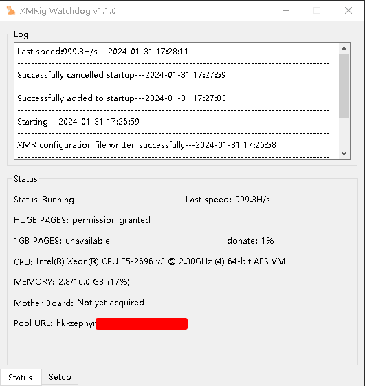
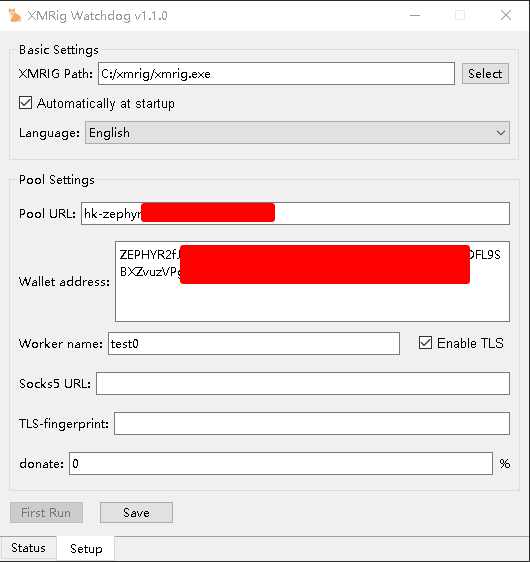

# XMRig Watchdog
---

### [中文](/README.md) | [English](README-EN.md)

### Description
A visual monitoring program for xmrig developed using python + pyqt5, with simple configuration. It automatically starts and monitors xmrig's operation.

### User Interface



### Update Log
##### 2024/1/21
- Added update detection.
##### 2024/1/25
- Added update program.
##### 2024/1/26
- Fixed configuration file error for xmrig.
##### 2024/1/27
- Fixed issues causing xmrig to fail to restart due to "n/a".
- Optimized watchdog code for restarting xmrig.
##### 2024/1/31
- Added language selection.
- Optimized mining rig information retrieval using regular expressions (re) instead of split.
##### 2024/2/22
- Fix program crashes caused by uninitialized 'value' in obtaining PC information.

### Download Releases
- On GitHub, click on "Releases" and download the latest version.
- On Gitee, click on "发行版" and download the latest version.


```bash
#Right-click on the downloaded .zip file and then click
解压到 "XMRigWatchdog\"(E)
```

### Build Yourself
Clone this project to your local machine.
Download python-3.12.0-embed-amd64.zip and unzip it. Rename the directory to "libs" and copy it to the program directory.

Modify the python312._pth file in the libs directory and remove the '#' in front of "import site".
```python
python312.zip
.

# Uncomment to run site.main() automatically
import site
```

Download get-pip.py to the libs directory.

Open a cmd window and navigate to the libs directory. Run the following commands:
```bash
python get-pip.py
# Wait for pip installation to complete. It may be slow and requires magic.
# Set a domestic source
python -m pip config set global.index-url https://pypi.tuna.tsinghua.edu.cn/simple

#Install virtualenv
python -m pip install virtualenv
```

Double-click on install.bat.

##### Testing
Open a cmd window and navigate to the program directory. Run the following commands:
```bash
# Activate the virtual environment first
.libs\scripts\activate
# Install dependencies
pip install -r requirements.txt
# 运Run and test
python main.py
```
##### Packaging
```bash
pyinstaller --noconfirm --windowed --icon "icon/icon.ico" --name "XMRigWatchdog" --upx-dir "你的upx路径"  "main.py"
```
If you are not using upx, remove --upx-dir "your_upx_path" from the command.

The packaged program will be in the dist directory.

### Building the Update Program
First, install the golang environment.

##### Set up the golang proxy
```bash
go env -w GOPROXY=https://goproxy.cn,direct
```

##### Enable go modules
```bash
go env -w GO111MODULE=on
```

##### Install dependencies
```bash
go mod tidy
```

##### Build update.exe
```bash
go build -ldflags="-s -w -H windowsgui" -o update.exe
```
---
### Donations
zeph
```
ZEPHs9Fkw8PAB1n2qx5m8FLXrYpZqWh7Na9W5uoSbTNtVuHiHc8fPBhgSsByWJti6RNGf8zfbAHc1d3AawnfWyMCaV16LomPqRq
```

xmr
```
88zqFaxMu9W4zaX6pxs2THV8XCnoE2a2Hgd1gSo4rP5kRfoBwXpHAVGAexEa1vcDexAZ1nsB4wK3BeqajJKnsnheUkq4oqb
```